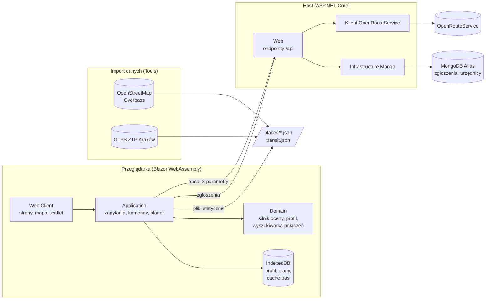

# Kraków bez barier

**Planer dostępnego miasta.** Użytkownik opisuje, czego potrzebuje, a aplikacja ocenia miejsca i układa trasę, którą da się faktycznie pokonać. Mieszkańcy mogą też zgłaszać urzędowi brakujące udogodnienia.

Projekt na hackathon **HackYeah 2026**, kategoria **„Kraków bez barier”** (Gmina Miejska Kraków).

> To samo miejsce i ta sama trasa dostają **inną ocenę dla każdego profilu**, zawsze z uzasadnieniem. Zamiast „dostępne: tak/nie” aplikacja podaje konkretne bariery i udogodnienia, a przy każdej cesze źródło i datę danych.

---

## Spis treści

- [Problem](#problem)
- [Co robi aplikacja](#co-robi-aplikacja)
- [Dla kogo](#dla-kogo)
- [Jak działa ocena dostępności](#jak-działa-ocena-dostępności)
- [Architektura](#architektura)
- [Uruchomienie](#uruchomienie)
- [Konfiguracja](#konfiguracja)
- [Wdrożenie na Mikrusa](#wdrożenie-na-mikrusa)
- [Dane i licencje](#dane-i-licencje)
- [API hosta](#api-hosta)
- [Testy](#testy)
- [Prywatność](#prywatność)
- [Ograniczenia](#ograniczenia)
- [Rozwój](#rozwój)

---

## Problem

Informacje o dostępności miejsc w Krakowie są rozproszone i zwykle zero-jedynkowe („dostępne dla niepełnosprawnych”). Osoba na wózku, osoba niewidoma, osoba w spektrum autyzmu i senior potrzebują jednak zupełnie innych informacji o tym samym muzeum. Do tego trzeba jeszcze dojechać: przejście 1,5 km po bruku albo przesiadka bez wiedzy o przystanku to realna bariera.

## Co robi aplikacja

| Funkcja | Opis |
|---|---|
| **Dwa tryby** | **Zwiedzam** (atrakcje, muzea, kultura, jedzenie) i **Załatwiam sprawę** (urzędy, przychodnie, biblioteki, przystanki) dla turystów i mieszkańców |
| **Profil potrzeb** | 11 gotowych profili, które można łączyć: wózek elektryczny i ręczny, kule lub balkonik, osoba niewidoma, głucha, słabosłysząca, spektrum autyzmu, nadwrażliwość sensoryczna, niepełnosprawność intelektualna, senior, wózek dziecięcy. Każdy parametr można potem zmienić |
| **Katalog miejsc** | blisko 29 000 miejsc w Krakowie w 18 kategoriach, na mapie i liście, posortowanych od najlepiej dopasowanych do profilu; filtr kategorii i wyszukiwarka po nazwie, adresie i rodzaju miejsca (np. „hotel”, „kawiarnia”), która nie rozróżnia polskich znaków |
| **Karta miejsca** | status (dostępne / z ograniczeniami / niedostępne / brak danych), bariery, udogodnienia, braki danych, a przy każdej cesze źródło i data |
| **Planer trasy** | kolejność przystanków (najbliższy sąsiad + 2-opt), trasa po ulicach dobrana do profilu (OpenRouteService: profil wózkowy, omijanie schodów, limit krawężnika), ostrzeżenia o stromych odcinkach; gdy odcinek jest dłuższy niż limit marszu z profilu, plan wskazuje ławki przy trasie, na których można odpocząć |
| **Komunikacja miejska** | dla odcinków dłuższych niż limit z profilu: linia, przystanki, godziny odjazdu i przyjazdu, najbliższe odjazdy, jedna przesiadka; rozkład ZTP Kraków (GTFS) |
| **Zgłoszenia mieszkańców** | na karcie miejsca: „brakuje udogodnienia / bariera / błędne dane”, z listą udogodnień i opisem; zgłoszenie jest anonimowe, a status i odpowiedź urzędu widać w zakładce „Zgłoszenia” |
| **Panel urzędnika** | logowanie, zestawienie (czego najczęściej brakuje, które miejsca mają najwięcej zgłoszeń), mapa zgłoszeń, zmiana statusu z odpowiedzią dla zgłaszającego |
| **Dostępny interfejs** | status zawsze jako kolor, znak i tekst; link „Przejdź do treści”; widoczny fokus; etykiety ARIA; mapa ma odpowiednik w postaci listy |

## Dla kogo

Scenariusze, na których projektowaliśmy aplikację:

- **Marta, turystka na wózku elektrycznym.** Wybiera 4-5 atrakcji i dostaje plan, który omija schody, wysokie krawężniki i bruk.
- **Kuba, w spektrum autyzmu.** Te same miejsca dostają inne oceny: liczy się hałas i tłum, a nie wejście bez stopni.
- **Pani Zofia, seniorka.** Idzie do urzędu i przychodni. Dostaje krótkie odcinki, a dłuższe zamienia na przejazd tramwajem lub autobusem według rozkładu.
- **Urzędnik miejski.** Widzi, których udogodnień mieszkańcy najczęściej potrzebują i w jakich miejscach.

## Jak działa ocena dostępności

Silnik oceny ([`src/Domain/Assessments`](src/Domain/Assessments)) dostaje profil potrzeb i cechy miejsca. Reguły dla ruchu, wzroku, słuchu, sensoryki, funkcji poznawczych i kondycji zwracają powody oceny.

- **Brak danych to nie dostępność.** Każda cecha ma trzy stany: `Yes` / `No` / `Unknown`. Jeśli profil wymaga cechy, której nie znamy, wynik to „brak danych”, nigdy „dostępne”.
- Bariera twarda (np. schody bez windy dla wózka) daje „niedostępne”, a bariera miękka lub wartość bliska progu daje „z ograniczeniami”.
- Status końcowy to najgorszy ze statusów cząstkowych.
- Braki danych dzielą się na blokujące (wejście, hałas, tłum) i informacyjne (toaleta, miejsca do siedzenia).
- Każdy powód ma źródło i datę, a dane demonstracyjne są wyraźnie oznaczone.

Ocena liczy się **w przeglądarce**, więc profil potrzeb nie opuszcza urządzenia.

## Architektura

Blazor Web App na .NET 10: host ASP.NET Core i klient WebAssembly. Kod jest podzielony na warstwy w stylu Clean Architecture z CQRS na MediatR.



| Projekt | Zawartość |
|---|---|
| [`Domain`](src/Domain) | model miejsc i cech, profil potrzeb z gotowymi profilami, silnik oceny, model planu, sieć komunikacji i wyszukiwarka połączeń, zgłoszenia |
| [`Application`](src/Application) | `Result`, `ICommand` / `IQuery` nad MediatR, zapytania o miejsca, profil, układanie planu, ranking podpowiedzi, zgłoszenia i zestawienie dla urzędu |
| [`Infrastructure`](src/Infrastructure) | katalog z plików statycznych, IndexedDB, klienci HTTP do hosta, klient routingu z cache i wariantem awaryjnym, klient OpenRouteService |
| [`Infrastructure.Mongo`](src/Infrastructure.Mongo) | MongoDB tylko po stronie hosta: konwencje zapisu, repozytorium zgłoszeń, konta urzędników (PBKDF2), sprawdzenie połączenia |
| [`Web`](src/Web) | host: serwuje aplikację, pośredniczy w routingu (klucz API zostaje na serwerze), przyjmuje zgłoszenia, loguje urzędników |
| [`Web.Client`](src/Web.Client) | interfejs: start, profil, miejsca, karta miejsca, plan, zgłoszenia, panel urzędnika |
| [`Tools`](src/Tools) | import miejsc z OpenStreetMap z ręcznymi uzupełnieniami i import rozkładu GTFS |
| [`Tests`](src/Tests) | testy jednostkowe (xUnit) |

**Odporność:** katalog i rozkład to pliki statyczne, więc awaria zewnętrznych serwisów nie wyłącza aplikacji. Routing ma trzy poziomy: zapytanie z ograniczeniami z profilu, potem bez ograniczeń (z ostrzeżeniem), a na końcu odcinek w linii prostej. Plan układa się zawsze, a trasy są zapamiętywane w IndexedDB.

**Skalowanie na inne miasta:** model ma `CityId` i `Coverage`, a import jest sparametryzowany. Kolejne miasto to wpis w [`CityImports`](src/Tools/CityImports.cs) i katalog `data/<miasto>/`.

## Uruchomienie

**Wymagania:** [.NET SDK 10](https://dotnet.microsoft.com/download/dotnet/10.0).

```bash
git clone https://github.com/Hackyeah2026/CRACOW_WITHOUT_BARRIERS.git
```

```bash
cd CRACOW_WITHOUT_BARRIERS
```

```bash
dotnet run --project src/Web --launch-profile http
```

Aplikacja działa pod adresem `http://localhost:5008`.

Działa od razu, bez żadnych kluczy: bez klucza OpenRouteService trasy są liczone w linii prostej, a bez MongoDB zgłoszenia i panel urzędnika zwracają komunikat „baza niedostępna”. Reszta aplikacji działa normalnie.

> Po przebudowie projektu uruchom aplikację ponownie i odśwież stronę (Ctrl+F5), żeby przeglądarka nie trzymała starych plików WebAssembly.

### Odświeżenie danych (opcjonalne)

Wyniki importu są w repozytorium ([`src/Web.Client/wwwroot/data`](src/Web.Client/wwwroot/data)), więc ten krok nie jest potrzebny do uruchomienia.

```bash
dotnet run --project src/Tools -- import krakow
```

```bash
dotnet run --project src/Tools -- transit krakow
```

## Konfiguracja

Sekrety trzymamy w `dotnet user-secrets` lokalnie i w zmiennych środowiskowych na serwerze. Nic nie trafia do repozytorium.

| Ustawienie | Po co | Zmienna na serwerze |
|---|---|---|
| `OpenRouteService:ApiKey` | trasy po ulicach dobrane do profilu ([darmowy klucz](https://openrouteservice.org/dev/#/signup)) | `OpenRouteService__ApiKey` |
| `OpenAI:ApiKey` | ocena zdjęć w zgłoszeniach: czy widać na nich przeszkodę | `OpenAI__ApiKey` |
| `OpenAI:Model` | model z obsługą obrazów (domyślnie `gpt-4.1-mini`) | `OpenAI__Model` |
| `Mongo:ConnectionString` | zgłoszenia i konta urzędników | `Mongo__ConnectionString` |
| `Mongo:Database` | nazwa bazy (domyślnie `krakow-bez-barier`) | `Mongo__Database` |
| `Officials:Seed:N:Login` / `Password` / `DisplayName` / `Unit` | konta urzędników zakładane przy starcie hosta | `Officials__Seed__0__Login` itd. |

Przykład:

```bash
dotnet user-secrets set "OpenRouteService:ApiKey" "<klucz>" --project src/Web
```

```bash
dotnet user-secrets set "OpenAI:ApiKey" "<klucz>" --project src/Web
```

```bash
dotnet user-secrets set "Mongo:ConnectionString" "mongodb+srv://<użytkownik>:<hasło>@<klaster>/" --project src/Web
```

```bash
dotnet user-secrets set "Officials:Seed:0:Login" "urzednik" --project src/Web
```

```bash
dotnet user-secrets set "Officials:Seed:0:Password" "<hasło>" --project src/Web
```

Stan połączenia z bazą sprawdzisz pod `GET /api/health/db`, a to, czy host działa, pod `GET /api/health`. Panel urzędnika jest pod `/urzednik` (link w stopce).

## Wdrożenie na Mikrusa

Aplikacja działa na Mikrusie 2.1 jako jeden kontener Dockera. Każdy push do `main` uruchamia [`.github/workflows/mikrus.yml`](.github/workflows/mikrus.yml):

1. `check`: build i testy (`infra/ci/check.sh`); pull requesty kończą się tutaj.
2. `package`: obraz z [`Dockerfile`](Dockerfile) (`package.sh`) i próbne uruchomienie kontenera (`smoke.sh`).
3. `deploy`: obraz trafia na serwer po SSH (bez rejestru), a [`infra/mikrus/deploy.sh`](infra/mikrus/deploy.sh) podmienia kontener `kbb-web` i sprawdza, czy odpowiada. Gdy nie odpowiada, wraca poprzedni obraz i poprzednie ustawienia.

Na serwerze potrzebny jest tylko Docker i `curl`. Kontener słucha na porcie `MIKRUS_HTTP_PORT`, ustawienia dostaje z pliku `/opt/kbb/app.env` (dostęp tylko dla roota), a klucze sesji trzyma w wolumenie `kbb-keys`, więc logowania przetrwają wdrożenie.

Ustawienia podajesz w GitHub: **Settings → Environments → `mikrus`**.

| Nazwa | Rodzaj | Wymagane | Wartość |
|---|---|---|---|
| `MIKRUS_HOST` | variable | tak | adres SSH serwera, np. `srv12.mikr.us` |
| `MIKRUS_SSH_PORT` | variable | tak | port SSH z panelu Mikrusa, np. `10303` |
| `MIKRUS_HTTP_PORT` | variable | tak | port serwera przydzielony w panelu, na którym ma słuchać aplikacja (1024–65535, inny niż SSH), np. `20303` |
| `MIKRUS_PUBLIC_URL` | variable | tak | publiczny adres HTTPS kierujący na ten port, np. `https://srv12-20303.wykr.es` |
| `MIKRUS_KEY` | secret | tak | klucz prywatny SSH do konta `root` (bez hasła) |
| `MIKRUS_KNOWN_HOSTS` | secret | tak | wynik `ssh-keyscan` dla serwera |
| `MONGO_CONNECTION_STRING` | secret | tak | `mongodb+srv://<użytkownik>:<hasło>@<klaster>/` |
| `MONGO_DATABASE` | variable | nie | nazwa bazy (domyślnie `krakow-bez-barier`) |
| `OPENROUTESERVICE_API_KEY` | secret | zalecane | bez niego nie działają trasy po ulicach |
| `OPENAI_API_KEY` | secret | zalecane | bez niego nie działa ocena zdjęć |
| `OPENAI_MODEL` | variable | nie | model z obsługą obrazów (domyślnie `gpt-4.1-mini`) |
| `OFFICIAL_LOGIN` | variable | zalecane | login konta urzędnika zakładanego przy starcie |
| `OFFICIAL_PASSWORD` | secret | razem z loginem | hasło tego konta |
| `OFFICIAL_DISPLAY_NAME` | variable | nie | imię i nazwisko urzędnika |
| `OFFICIAL_UNIT` | variable | nie | jednostka urzędnika |

`Certificates:PublicBaseUrl` (adres w kodach QR na certyfikatach) ustawia się sam z `MIKRUS_PUBLIC_URL`. Każda wartość musi mieścić się w jednej linii.

Klucz wdrożeniowy i odcisk serwera przygotujesz tak:

```bash
ssh-keygen -t ed25519 -N "" -C "github-kbb-deploy" -f mikrus_deploy
```

```bash
ssh-copy-id -i mikrus_deploy.pub -p <MIKRUS_SSH_PORT> root@<MIKRUS_HOST>
```

```bash
ssh-keyscan -p <MIKRUS_SSH_PORT> <MIKRUS_HOST>
```

Zawartość pliku `mikrus_deploy` to `MIKRUS_KEY`, a wynik `ssh-keyscan` to `MIKRUS_KNOWN_HOSTS`. W MongoDB Atlas dodaj adres wychodzący serwera do **Network Access**, inaczej wdrożenie zakończy się błędem „Database check failed”.

Zmiana samego sekretu nie wymaga commita: uruchom workflow ręcznie (**Actions → Mikrus checks and deploy → Run workflow**). Logi aplikacji na serwerze: `docker logs --tail 100 kbb-web`.

Obraz zbudujesz i uruchomisz też lokalnie:

```bash
docker build -t kbb-web:local .
```

```bash
docker run --rm -p 8080:8080 -e Mongo__ConnectionString="<adres>" kbb-web:local
```

## Dane i licencje

| Źródło | Co bierzemy | Licencja |
|---|---|---|
| [OpenStreetMap](https://www.openstreetmap.org/copyright) (Overpass API) | 28 971 miejsc w 18 kategoriach (po jednym pliku na kategorię): m.in. ławki, sklepy, jedzenie, przystanki, koperty, zdrowie, apteki, urzędy, atrakcje, parki, toalety; tagi `wheelchair`, `toilets:wheelchair`, `tactile_paving`, `bench`, `shelter`, `elevator`, `hearing_loop` | ODbL, © autorzy OpenStreetMap |
| [GTFS ZTP Kraków](https://gtfs.ztp.krakow.pl/) | 218 linii, ok. 95 tys. kursów, 3 474 przystanki | według zasad udostępniania ZTP |
| [OpenRouteService](https://openrouteservice.org/) | trasy piesze i wózkowe | według regulaminu usługi |
| Uzupełnienia zespołu ([`overrides/krakow.json`](src/Tools/overrides/krakow.json)) | cechy sensoryczne i szczegóły dla miejsc ze ścieżki demo | **dane demonstracyjne**, oznaczone w aplikacji, niezweryfikowane |

Zależności: MediatR 12.4.1 (Apache-2.0), MongoDB.Driver 3.12.0 (Apache-2.0), Leaflet 1.9.4 (BSD-2, w repozytorium, bez CDN), Bootstrap (MIT).

## API hosta

| Metoda i ścieżka | Opis | Dostęp |
|---|---|---|
| `POST /api/route` | trasa po ulicach; przyjmuje tylko punkty i 3 parametry (wózek, schody, krawężnik) | publiczny |
| `GET /api/health/db` | stan połączenia z MongoDB | publiczny |
| `POST /api/reports` | nowe zgłoszenie (limit 10 na 10 min z jednego IP) | publiczny, anonimowy |
| `POST /api/photos/analyze` | ocena zdjęcia przez OpenAI (multipart, pole `photo`, JPEG/PNG/WebP do 4 MB, limit 20 na 10 min z jednego IP); ta wersja zdjęcia nie jest zapisywana | mieszkaniec |
| `GET /api/photos/{id}` | zdjęcie dołączone do zgłoszenia (JPEG do 300 KB, zapisywane razem ze zgłoszeniem) | urzędnik albo konto, które je wysłało |
| `POST /api/reports/status` | status zgłoszeń po identyfikatorach | publiczny |
| `POST /api/official/login` / `logout` | sesja urzędnika (ciasteczko HttpOnly, SameSite=Strict) | publiczny, limit 5 prób na minutę |
| `GET /api/official/me` | zalogowany urzędnik | urzędnik |
| `GET /api/official/reports?cityId=&status=&placeId=` | lista zgłoszeń | urzędnik |
| `PATCH /api/official/reports/{id}` | zmiana statusu i odpowiedź dla zgłaszającego | urzędnik |
| `GET /api/plans`, `GET /api/plans/{id}`, `POST /api/plans`, `PUT /api/plans/{id}`, `DELETE /api/plans/{id}` | nazwane plany konta: lista, plan z zapisaną trasą, utworzenie, zmiana nazwy i miejsc, usunięcie | konto |
| `POST /api/plans/{id}/close` | zapis wyznaczonej trasy; zamyka plan, którego potem nie można edytować (zmiana → 409) | konto |
| `GET /api/businesses?cityId=` | miejsca z certyfikatem konta firmowego i deklaracje firm | publiczny |
| `GET /api/business/mine`, `POST /api/business/application` | wniosek o konto firmowe i jego stan | konto |
| `PUT /api/business/features`, `GET /api/business/certificate` | oznaczenia udogodnień i certyfikat SVG z kodem QR | konto firmowe zatwierdzone przez urząd |
| `GET /api/official/businesses?cityId=`, `PATCH /api/official/businesses/{login}` | wnioski o konta firmowe i decyzja | urzędnik |

## Testy

```bash
dotnet test src/Tests
```

170 testów jednostkowych obejmuje m.in.: plany konta i zapis trasy, scenariusz samouczka, silnik oceny dla person, łączenie profili, wyszukiwanie miejsc, kolejność przystanków, układanie planu, dobór ławek na przerwę, zapytania i odpowiedzi OpenRouteService, wyszukiwarkę połączeń komunikacji, zapis dokumentów w MongoDB, zachowanie bez bazy, walidację zgłoszeń, hasła urzędników i zestawienie zgłoszeń.

## Prywatność

Profil potrzeb to dane o zdrowiu, dlatego:

- profil, plany i cache tras są tylko w **IndexedDB na urządzeniu**; nie używamy ciasteczek ani kont dla mieszkańców;
- **ocena miejsc liczy się w przeglądarce**;
- do routingu idą tylko punkty trasy i trzy parametry (wózek, unikanie schodów, maksymalny krawężnik), a nie cały profil;
- plan zalogowanego konta (nazwa i miejsca) jest w bazie hosta; zapisana trasa trafia tam bez oceny miejsc, którą aplikacja liczy od nowa na urządzeniu, ale z ostrzeżeniami odcinków (np. o limicie marszu) i punktem startu, jeśli był wskazany; plan bez konta zostaje na urządzeniu;
- zgłoszenie zawiera tylko miejsce, wybrane udogodnienia i opis, bez profilu i danych osobowych;
- zdjęcie dołączone do zgłoszenia przeglądarka zmniejsza i zapisuje jako JPEG (bez EXIF, więc bez położenia GPS); host przekazuje je do oceny w OpenAI, a zmniejszoną kopię (do 1024 px i 300 KB) zapisuje w bazie jako część zgłoszenia; widzi ją urzędnik i zgłaszający;
- klucze API i adres bazy są tylko na hoście.

## Ograniczenia

Mówimy o nich wprost, także w aplikacji:

- OpenStreetMap ma niepełne dane o dostępności, a o hałasie i tłumie prawie żadnych. Dla wielu miejsc uczciwy wynik to „brak danych”.
- GTFS ZTP nie zawiera informacji o niskopodłogowości pojazdów ani dostępności przystanków. Aplikacja proponuje przejazd, ale ostrzega, że tego nie wie.
- Godziny komunikacji są rozkładowe, bez opóźnień.
- Część cech miejsc ze ścieżki demo to dane demonstracyjne zespołu.
- Zgłoszenia trafiają do urzędu, ale nie zmieniają jeszcze oceny miejsc.

Szczegółowy stan prac: [`doc/stan-realizacji.md`](doc/stan-realizacji.md).

## Rozwój

- **Dane miejskie:** mapa hałasu i budynki publiczne z MSIP Kraków, wiaty i koperty z ArcGIS Hub ZTP, deklaracje dostępności instytucji.
- **Komunikacja na żywo:** GTFS-RT z opóźnieniami, dane o taborze niskopodłogowym.
- **Zgłoszenia zmieniają dane:** zgłoszenia potwierdzone przez urzędnika jako osobne źródło cech na karcie miejsca i w ocenie.
- **Panel dla miasta:** mapa najczęściej zgłaszanych barier jako wsparcie decyzji inwestycyjnych; weryfikacja przez organizacje pozarządowe.
- **Publiczne API z OpenAPI** dla instytucji kultury i branży turystycznej.
- **Kolejne miasta:** import z OpenStreetMap działa dla dowolnego obszaru.
- **Opis planu w prostym języku (AI)**, tryb offline (PWA), harmonogram godzinowy dnia.

---

Dokumentacja projektu: [wymagania konkursu](doc/WYMAGANIA_KONKURSU.md) · [plan prac](doc/plan-prac.md) · [plan implementacji](doc/plan-implementacji.md) · [stan realizacji](doc/stan-realizacji.md)
