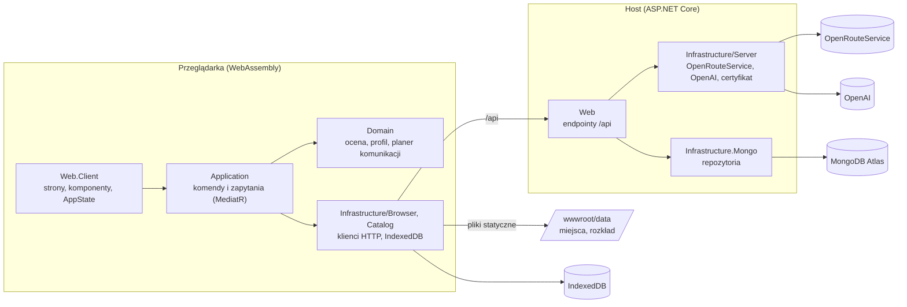
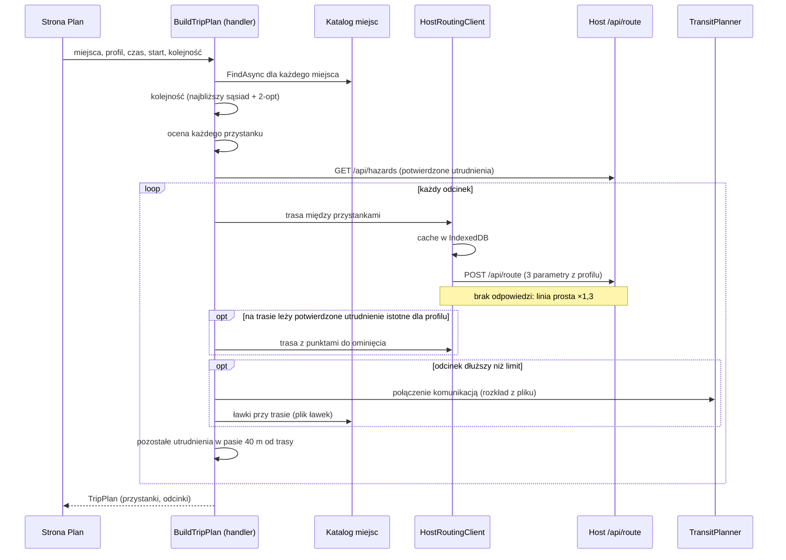
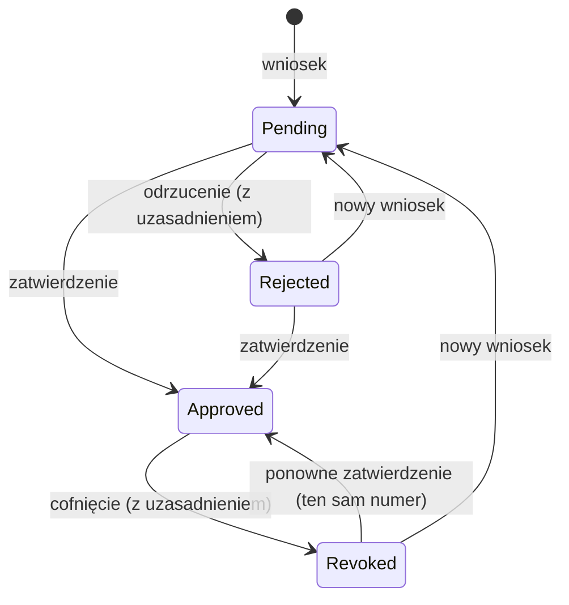

# Jak działa aplikacja „Kraków bez barier”

Stan na **4.10.2026**, po refaktoryzacji na gałęzi `plany-konta`. Dokument opisuje działanie aplikacji od strony kodu: co uruchamia się w przeglądarce, co na hoście, skąd biorą się dane i jak przebiegają najważniejsze operacje. Uzupełnia [README](../README.md) (opis dla użytkownika i wdrożenie) i [stan realizacji](stan-realizacji.md) (historia prac i lista problemów).

## Spis treści

1. [W skrócie](#1-w-skrócie)
2. [Architektura](#2-architektura)
3. [Gdzie leżą dane](#3-gdzie-leżą-dane)
4. [Start aplikacji i stan sesji](#4-start-aplikacji-i-stan-sesji)
5. [Profil potrzeb](#5-profil-potrzeb)
6. [Ocena dostępności miejsca](#6-ocena-dostępności-miejsca)
7. [Katalog miejsc i wyszukiwanie](#7-katalog-miejsc-i-wyszukiwanie)
8. [Plan trasy](#8-plan-trasy)
9. [Komunikacja miejska](#9-komunikacja-miejska)
10. [Konta i sesje](#10-konta-i-sesje)
11. [Zgłoszenia, punkty na mapie i zdjęcia](#11-zgłoszenia-punkty-na-mapie-i-zdjęcia)
12. [Konta firmowe i certyfikat](#12-konta-firmowe-i-certyfikat)
13. [Panel urzędnika](#13-panel-urzędnika)
14. [API hosta](#14-api-hosta)
15. [Import danych](#15-import-danych)
16. [Konfiguracja i wdrożenie](#16-konfiguracja-i-wdrożenie)
17. [Testy](#17-testy)
18. [Jak rozszerzać](#18-jak-rozszerzać)
19. [Znane ograniczenia](#19-znane-ograniczenia)

## 1. W skrócie

Użytkownik opisuje swoje potrzeby (profil), a aplikacja ocenia pod ten profil miejsca w Krakowie i układa trasę między wybranymi miejscami. Mieszkaniec z kontem zgłasza urzędowi bariery i braki udogodnień, urzędnik obsługuje je w panelu, a firma po zatwierdzeniu przez urząd sama deklaruje udogodnienia swojego lokalu i dostaje certyfikat z kodem QR.

Trzy zasady, które widać w całym kodzie:

- **Brak danych to nie dostępność.** Każda cecha miejsca ma stan `Yes` / `No` / `Unknown`, a ocena „dostępne” wymaga potwierdzonego udogodnienia.
- **Profil potrzeb nie opuszcza urządzenia.** Ocena miejsc i układanie planu liczą się w przeglądarce. Do hosta idą tylko trzy parametry trasy (wózek, schody, krawężnik) i położenia publicznych, potwierdzonych utrudnień, które trasa ma ominąć.
- **Aplikacja działa także bez usług zewnętrznych.** Katalog i rozkład to pliki statyczne; bez silnika tras odcinki są szacowane w linii prostej, bez bazy nie działają tylko konta, zgłoszenia i plany konta.

## 2. Architektura

Blazor Web App na .NET 10. Cały interfejs działa w przeglądarce jako WebAssembly (bez prerenderingu), a host ASP.NET Core serwuje pliki i wystawia API.



| Projekt | Gdzie działa | Co zawiera |
|---|---|---|
| [`Domain`](../src/Domain) | przeglądarka i host | model (miejsce, cecha, profil, plan, zgłoszenie, punkt, konto firmowe), walidacja danych wejściowych, silnik oceny, geometria trasy, planer komunikacji, dobór ławek |
| [`Application`](../src/Application) | przeglądarka (handlery), host (interfejsy) | `Result`, `ICommand` / `IQuery`, handlery MediatR, interfejsy klientów i repozytoriów w `Abstractions` |
| [`Infrastructure`](../src/Infrastructure) | `Browser`, `Catalog`, `Routing`: przeglądarka; `Server`: host | klienci HTTP do hosta, katalog z plików, IndexedDB; klient OpenRouteService, OpenAI, generator certyfikatu |
| [`Infrastructure.Mongo`](../src/Infrastructure.Mongo) | tylko host | repozytoria MongoDB, skróty haseł, indeksy i konta urzędników zakładane przy starcie |
| [`Web`](../src/Web) | host | `Program.cs` (uwierzytelnianie, limity), endpointy w `Endpoints/` |
| [`Web.Client`](../src/Web.Client) | przeglądarka | strony (`Pages`), komponenty, `AppState`, `Labels`, moduły JS |
| [`Tools`](../src/Tools) | offline | import miejsc z OpenStreetMap i rozkładu GTFS do plików w `wwwroot/data` |
| [`Tests`](../src/Tests) | CI | testy jednostkowe (xUnit) |

**Zależności między warstwami.** `Domain` nie zależy od niczego. `Application` zna tylko `Domain`. `Infrastructure` i `Infrastructure.Mongo` implementują interfejsy z `Application/Abstractions`. Sterownik MongoDB jest w osobnym projekcie, bo `Infrastructure` trafia też do przeglądarki.

**Jak komponent rozmawia z resztą.** Strona wysyła komendę albo zapytanie przez `ISender` (MediatR). Handler w `Application` waliduje dane (`Validate()` w rekordzie domenowym, pomocnik `IfValidAsync`), a potem woła interfejs: katalog, magazyn na urządzeniu albo klienta hosta. Każdy handler zwraca `Result` / `Result<T>`; błędy biznesowe nie są wyjątkami. Klienci hosta zamieniają kody HTTP na komunikaty dla użytkownika w jednym miejscu: [`HostApi`](../src/Infrastructure/Browser/HostApi.cs).

**Jak zbudowany jest endpoint.** Każdy plik w `Web/Endpoints` to jedna grupa adresów. Wspólne elementy są w [`Api`](../src/Web/Endpoints/Api.cs): odpowiedź 400 z błędami walidacji, 409, sprawdzenie identyfikatora, limity i filtr, który zamienia `DatabaseUnavailableException` na 503. Ta sama metoda `Validate()` działa w przeglądarce (szybka informacja dla użytkownika) i na hoście (host nie ufa przeglądarce).

## 3. Gdzie leżą dane

| Dane | Gdzie | Kto czyta i pisze |
|---|---|---|
| Katalog miejsc: `data/{miasto}/places/index.json` i po jednym pliku na kategorię | pliki statyczne w `Web.Client/wwwroot/data` | pisze `Tools`, czyta przeglądarka ([`HttpPlaceCatalog`](../src/Infrastructure/Catalog/HttpPlaceCatalog.cs)) |
| Rozkład komunikacji: `data/{miasto}/transit.json` | plik statyczny | pisze `Tools`, czyta przeglądarka przy układaniu planu |
| Lista miast: `data/cities.json` | plik statyczny | przeglądarka |
| Profil potrzeb (tymczasowy i profile kont), stan sesji | IndexedDB, magazyn `profile` | tylko przeglądarka |
| Cache tras | IndexedDB, magazyn `routeCache` | [`HostRoutingClient`](../src/Infrastructure/Browser/HostRoutingClient.cs) |
| Miejsca znalezione po identyfikatorze oraz identyfikatory, których w katalogu nie ma | IndexedDB, magazyn `placeCache` | `HttpPlaceCatalog` |
| Zgłoszenia miejsc, punkty z utrudnieniami, zdjęcia, konta mieszkańców, firm i urzędników, plany kont | MongoDB: `reports`, `hazards`, `photos`, `users`, `businesses`, `officials`, `plans` | tylko host |

W magazynie `profile` są trzy rodzaje wpisów: `current` (konfiguracja tymczasowa bez konta), `account:{login}` (profil konta) i `session` (tryb, miasto, miejsca planu bez konta, otwarty plan konta, przełącznik automatycznej kolejności).

Dokumenty w MongoDB to rekordy domenowe zapisane wprost: pola camelCase, enumy jako tekst, nieznane pola pomijane ([`MongoConventions`](../src/Infrastructure.Mongo/MongoConventions.cs)). Kluczem `_id` jest identyfikator rekordu, a dla kont login.

## 4. Start aplikacji i stan sesji

Host zwraca szkielet strony ([`App.razor`](../src/Web/Components/App.razor)) i uruchamia Blazor WebAssembly. Od tej chwili nawigacja między stronami odbywa się w przeglądarce.

Stan wspólny dla stron trzyma [`AppState`](../src/Web.Client/Services/AppState.cs) (jeden na kartę przeglądarki). Każda strona zaczyna od `EnsureLoadedAsync()`, które raz na sesję:

1. pyta host, kto jest zalogowany (`GET /api/account/me`; 401 oznacza gościa);
2. czyta profil: profil konta albo konfigurację tymczasową;
3. czyta wpis `session` z IndexedDB;
4. dla zalogowanego pobiera listę planów konta;
5. czyta listę miast.

Komponenty, które pokazują stan (nawigacja z licznikiem miejsc w planie, podsumowanie profilu), subskrybują zdarzenie `AppState.Changed`.

| Adres | Strona | Co robi |
|---|---|---|
| `/` | `Home` | wybór trybu; dla zalogowanego pulpit: profil, plan, zgłoszenia |
| `/profil` | `Profile` | edytor konfiguracji tymczasowej albo podsumowanie profilu konta |
| `/miejsca` | `Places` | mapa i lista miejsc ocenionych pod profil |
| `/miejsca/{id}` | `PlaceDetails` | karta miejsca; `?miasto=` pochodzi z kodu QR na certyfikacie |
| `/plan` | `Plan` | lista miejsc planu, plany konta, ułożona trasa |
| `/zglos` | `ReportOnMap` | punkt z utrudnieniem albo zgłoszenie miejsca wybranego na mapie |
| `/konto`, `/konto/profil`, `/konto/firma`, `/zgloszenia` | `Account` | logowanie i rejestracja, moje zgłoszenia, profil konta, konto firmowe |
| `/urzednik` | `Official` | panel urzędnika |

## 5. Profil potrzeb

[`NeedsProfile`](../src/Domain/Needs/NeedsProfile.cs) to zestaw potrzeb funkcjonalnych, a nie diagnoza: wejście bez stopni, unikanie schodów i bruku, próg i szerokość drzwi, toaleta dostosowana, tolerancja hałasu i tłumu (1-3), miejsca do siedzenia, limit marszu bez odpoczynku, tempo marszu, potrzeby wzrokowe, słuchowe i poznawcze.

[`NeedsProfilePresets`](../src/Domain/Needs/NeedsProfilePresets.cs) zawiera 11 gotowych profili. Zaznaczone profile są łączone przez `CombineWith`: w każdym parametrze wygrywa wartość bardziej restrykcyjna (niższy próg, szersze drzwi, krótszy limit marszu, wolniejsze tempo). Potem użytkownik może zmienić każdy parametr osobno. Zaznaczenie albo odznaczenie gotowego profilu przelicza parametry od nowa z samych profili.

Zapis: `SaveProfileCommand` → IndexedDB. Konto, które nie ma jeszcze profilu na danym urządzeniu, przejmuje konfigurację tymczasową przy pierwszym logowaniu ([`GetProfileQuery`](../src/Application/Profile/Profile.cs)).

## 6. Ocena dostępności miejsca

[`AssessmentEngine.Assess(profil, miejsce)`](../src/Domain/Assessments/AssessmentEngine.cs) uruchamia sześć reguł z [`Rules.cs`](../src/Domain/Assessments/Rules.cs). Każda reguła patrzy tylko na te parametry profilu, które są ustawione, i zwraca powody trzech rodzajów:

| Rodzaj powodu | Wpływ na ocenę |
|---|---|
| bariera | `Inaccessible` (twarda, np. stopnie dla wózka) albo `Limited` (miękka, np. brak ławek) |
| udogodnienie | `Accessible` |
| brak danych | `Unknown`, gdy brak blokuje ocenę (wejście, hałas, tłum, pies asystujący, PJM w instytucji publicznej); w pozostałych przypadkach tylko informacja |

| Reguła | Sprawdza |
|---|---|
| `MobilityRule` | dostęp dla wózków, wejście bez stopni, schody i winda, próg, drzwi, bruk, toaleta dostosowana |
| `SensoryRule` | poziom hałasu i tłumu względem tolerancji, pokój wyciszenia, ciche godziny |
| `StaminaRule` | ławki i miejsca do siedzenia |
| `VisionRule` | ścieżki dotykowe, audiodeskrypcja, pies asystujący |
| `HearingRule` | PJM, pętla indukcyjna, informacja wizualna |
| `CognitiveRule` | tekst łatwy do czytania, piktogramy |

Status końcowy to najgorszy wpływ spośród powodów. Jeśli wyszło „dostępne”, ale żaden powód nie jest potwierdzonym udogodnieniem, status spada do „brak danych”. Pusty profil nie daje żadnych powodów, więc ocena to „brak danych”.

Każdy powód niesie źródło cechy i znacznik danych demonstracyjnych, które karta miejsca pokazuje obok komunikatu.

## 7. Katalog miejsc i wyszukiwanie

**Wczytywanie.** Katalog jest podzielony na pliki per kategoria. `HttpPlaceCatalog` pobiera plik przy pierwszym użyciu i trzyma go w pamięci do końca sesji; równoległe zapytania o ten sam plik czekają na jedno pobranie, a nieudane pobranie jest ponawiane przy następnym zapytaniu. Szukanie po identyfikatorze (`FindAsync`) sprawdza po kolei: pliki już wczytane, `placeCache` w IndexedDB (ważny do następnego importu), a na końcu brakujące pliki od najmniejszego. Gdy miejsca nie ma w żadnym pliku, `placeCache` zapamiętuje także ten brak, więc drugie pytanie o ten sam identyfikator nie czyta znowu całego katalogu.

**Certyfikaty.** Katalog jest opakowany dekoratorem [`CertifiedPlaceCatalog`](../src/Infrastructure/Catalog/CertifiedPlaceCatalog.cs): do miejsc zatwierdzonych firm dopisuje certyfikat i deklaracje (publiczna lista z `GET /api/businesses`, pamiętana przez 30 s). Dzięki temu lista, karta miejsca i plan widzą te same dane bez zmian w zapytaniach. Gdy host nie odpowiada, katalog zwraca miejsca tak, jak są w plikach.

**Zakres listy** ([`ModeCategories`](../src/Application/Places/Places.cs)):

| Sytuacja | Kategorie |
|---|---|
| tryb „Zwiedzam”, bez frazy | atrakcja, muzeum, kultura, miejsce kultu, park, jedzenie |
| tryb „Załatwiam sprawę”, bez frazy | urząd, usługi, zdrowie, apteka, biblioteka, kultura, przystanek |
| wpisana fraza, bez kategorii | kategorie trybu oraz toalety, sklepy, noclegi i szkoły |
| wybrana kategoria | tylko ona (jedyny sposób, żeby zobaczyć ławki i koperty) |
| „tylko z certyfikatem”, bez kategorii | kategorie, w których są miejsca z certyfikatem, także spoza trybu |

**Dopasowanie frazy** ([`PlaceSearch`](../src/Application/Places/Places.cs)): każde słowo musi pasować do nazwy, adresu albo rodzaju miejsca (rdzenie słów na kategorię, np. „hotel” i „nocleg” dla noclegów). Wielkość liter i polskie znaki nie mają znaczenia.

**Kolejność** (`GetPlacesQuery`): najpierw miejsca z frazą w nazwie albo adresie, potem dopasowane po rodzaju; w obu grupach malejąco według punktów [`SuggestionRanker`](../src/Application/Places/Places.cs): ocena (dostępne 3, z ograniczeniami 1,5, brak danych 1, niedostępne -5) + 0,2 za każde potwierdzone udogodnienie (najwyżej 5) - 0,3 za każdy kilometr od centrum miasta.

**Mapa.** [`MapView`](../src/Web.Client/Components/MapView.razor) steruje Leafletem przez [`map.js`](../src/Web.Client/wwwroot/js/map.js). Lista i statystyki pokazują tylko miejsca z widocznego obszaru mapy. Powyżej 600 pinezek symbole są zastępowane kółkami rysowanymi na płótnie.

## 8. Plan trasy

Plan układa [`BuildTripPlanCommand`](../src/Application/Trips/BuildTripPlan.cs), w całości w przeglądarce.



Kolejne kroki:

1. **Miejsca i start.** Startem jest pierwsze miejsce z listy albo punkt spoza katalogu: lokalizacja z przeglądarki ([`BrowserLocation`](../src/Web.Client/Services/BrowserLocation.cs)) lub punkt wskazany na mapie. Punkt startu dalej niż 30 km od centrum miasta jest odrzucany. Bez punktu startu potrzebne są co najmniej dwa miejsca.
2. **Kolejność.** [`StopOrderOptimizer`](../src/Application/Trips/StopOrderOptimizer.cs): najbliższy sąsiad, potem poprawka 2-opt, na odległościach w linii prostej. Start zostaje na miejscu. Użytkownik może wyłączyć układanie i zostawić kolejność z listy.
3. **Trasa odcinka.** `HostRoutingClient` najpierw sprawdza cache w IndexedDB, potem pyta host. Host ([`OpenRouteServiceClient`](../src/Infrastructure/Server/OpenRouteServiceClient.cs)) wybiera profil `wheelchair` (z limitem krawężnika) albo `foot-walking` (z omijaniem schodów, gdy profil tego chce). Gdy zapytanie z ograniczeniami się nie uda, ponawia je bez ograniczeń i dodaje ostrzeżenie. Gdy host nie odpowiada, odcinek jest szacowany w linii prostej z mnożnikiem 1,3 i oznaczony jako szacunkowy. Czas przejścia zawsze liczy przeglądarka z tempa w profilu.
4. **Objazd utrudnień.** Gdy trasa odcinka prowadzi przez punkt potwierdzony przez urząd, plan pyta o trasę drugi raz, z listą punktów do ominięcia ([`HazardRules.Blocking`](../src/Domain/Hazards/Hazard.cs)).
   - **Co omijamy:** przeszkody fizyczne (schody, krawężnik, nawierzchnia, stromy odcinek, wąskie przejście, roboty), które dotyczą profilu i leżą do 15 m od trasy. Punktów bliżej niż 40 m od początku albo końca odcinka nie omijamy, bo tam trzeba dojść.
   - **Jak:** host zamienia każdy punkt na kwadrat o boku 40 m w `avoid_polygons` OpenRouteService. Zapytanie o objazd nie jest ponawiane bez ograniczeń.
   - **Kiedy objazd wchodzi do planu:** gdy nie jest dłuższy o więcej niż 1 km i sam nie prowadzi przez kolejny punkt; jeśli prowadzi, druga próba omija oba ([`DetourRules`](../src/Application/Trips/BuildTripPlan.cs)). Bez objazdu zostaje najkrótsza trasa z ostrzeżeniem.
   - **Co zostaje w planie:** ominięte punkty, różnica długości i najkrótsza trasa (`RouteDetour` w odcinku). Mapa rysuje ją czerwoną linią kropkowaną obok trasy planu.
5. **Utrudnienia przy trasie.** [`HazardRules.AlongRoute`](../src/Domain/Hazards/Hazard.cs) dopisuje do odcinka pozostałe punkty potwierdzone przez urząd, leżące do 40 m od trasy, w kolejności marszu, z informacją, czy dotyczą profilu. Rzut punktu na trasę liczy wspólna [`RouteGeometry`](../src/Domain/Places/RouteGeometry.cs).
6. **Komunikacja.** Dla odcinka dłuższego niż limit marszu z profilu (bez limitu: ponad 1 km) planer szuka połączenia. Rozkład jest pobierany dopiero wtedy, gdy trafi się taki odcinek.
7. **Ławki.** Gdy profil ma limit marszu, odcinek go przekracza i trasa nie jest szacunkowa, [`RestStopRules`](../src/Domain/Trips/RestStopRules.cs) wybiera ławki do 30 m od trasy: każda kolejna to najdalsza, do której da się dojść w limicie. Jeśli ławek nie ma na całej trasie, plan podaje najdłuższy fragment bez przerwy.

Wynik rysuje komponent [`TripPlanView`](../src/Web.Client/Components/TripPlanView.razor): przystanki z oceną, odcinki z ostrzeżeniami, panel komunikacji ([`TransitPanel`](../src/Web.Client/Components/TransitPanel.razor)) i mapa z legendą.

### Czytanie na głos

Plan i karta miejsca mają przycisk „Czytaj na głos” ([`ReadAloud`](../src/Web.Client/Components/ReadAloud.razor)).

- **Tekst** układa [`Narration`](../src/Web.Client/Services/Narration.cs) z tych samych danych co widok: podsumowanie, a potem na zmianę przystanek i odcinek (ostrzeżenia, objazd, utrudnienia, ławki, pierwsze połączenie komunikacją); dla miejsca ocena i powody. Jednostki są zapisane słowami, daty i źródła pominięte. Bez modelu językowego, więc tekst nie zawiera niczego, czego nie ma na ekranie.
- **Głos** to syntezator mowy przeglądarki ([`speech.js`](../src/Web.Client/wwwroot/js/speech.js)). Używamy tylko polskiego głosu działającego na urządzeniu, bo tekst wynika z profilu potrzeb. Gdy takiego głosu nie ma, przycisk się nie pojawia.
- Czytanie zatrzymuje ten sam przycisk, zmiana planu albo przejście na inną stronę.

### Plany konta

- **Bez konta:** jeden plan, lista miejsc we wpisie `session` w IndexedDB.
- **Z kontem:** nazwane plany w kolekcji `plans` (najwyżej 50 na konto, 30 miejsc w planie). Każda zmiana listy miejsc to `PUT /api/plans/{id}`. Przycisk „Do planu” otwiera okno wyboru planu ([`PlanPicker`](../src/Web.Client/Components/PlanPicker.razor)).
- **Miejsca, których nie ma już w katalogu:** identyfikator zapisany w planie może zniknąć po ponownym imporcie z OpenStreetMap. Strona Plan wczytuje miejsca zapytaniem [`GetPlanPlacesQuery`](../src/Application/Places/Places.cs), które zwraca osobno znalezione miejsca i brakujące identyfikatory. Brakujące są usuwane z planu (`AppState.RemovePlacesAsync`: wpis `session` albo `PUT /api/plans/{id}`), a użytkownik widzi informację, ile miejsc ubyło. Gdy host nie zapisze planu konta, miejsca są tylko pomijane na liście.
- **Zamknięcie planu:** „Zapisz trasę i zamknij plan” wysyła ułożoną trasę jako JSON (`POST /api/plans/{id}/close`). Zamkniętego planu nie da się edytować (host odpowiada 409). Trasa jest zapisywana bez oceny miejsc ([`SavedRoutes`](../src/Application/Trips/SavedPlans.cs)); przy otwarciu ocena liczy się na urządzeniu dla bieżącego profilu.

## 9. Komunikacja miejska

[`TransitPlanner`](../src/Domain/Transit/TransitPlanner.cs) szuka połączenia według rozkładu, z najwyżej jedną przesiadką. To algorytm rundowy (jak RAPTOR): runda 1 to przejazdy bezpośrednie, runda 2 to przejazdy po przesiadce.

| Parametr | Wartość |
|---|---|
| dojście do przystanku | odległość w linii prostej ×1,3; najwyżej limit marszu z profilu, a bez limitu 600 m |
| przesiadka | przejście do 200 m, zapas 2 minuty |
| okno szukania | odjazd w ciągu 2 godzin od chwili ułożenia planu |
| warunek sensu | połączenie musi dawać mniej chodzenia niż przejście całego odcinka |

Format rozkładu ([`Transit.cs`](../src/Domain/Transit/Transit.cs)) jest zwarty, żeby plik dało się wczytać w przeglądarce: linia ma przebiegi (kolejność przystanków), przebieg ma warianty czasów przejazdu i kursy zapisane po trzy liczby (minuta startu, wariant czasów, dni kursowania).

Wynik dla odcinka to `TransitAdvice`: znalezione połączenia albo powód ich braku (brak przystanku w zasięgu, brak połączenia w oknie, rozkład nie obejmuje dnia), zawsze ze źródłem i zakresem ważności rozkładu.

## 10. Konta i sesje

| | Mieszkaniec (także firma) | Urzędnik |
|---|---|---|
| Skąd konto | rejestracja: login i hasło, bez e-maila | konfiguracja hosta (`Officials:Seed`), zakładane przy starcie |
| Ciasteczko | `kbb.user`, 30 dni | `kbb.official`, 8 godzin |
| Polityka | `user` (osobny schemat uwierzytelniania) | `official` (rola w schemacie domyślnym) |
| Kolekcja | `users` | `officials` |

Oba ciasteczka są `HttpOnly` i `SameSite=Strict`, więc kod w przeglądarce ich nie widzi, a obie sesje mogą działać obok siebie i żadna nie daje uprawnień drugiej. Hasła to PBKDF2-SHA256 z losową solą ([`PasswordHashing`](../src/Infrastructure.Mongo/Accounts/PasswordHashing.cs)); sprawdzenie hasła nieistniejącego konta trwa tyle samo co istniejącego.

Login zalogowanego host bierze zawsze z sesji, nigdy z treści żądania: dopisuje go do zgłoszenia (`reportedBy`), do planu (`owner`) i używa jako klucza konta firmowego.

Limity z jednego adresu IP: logowanie 5 prób na minutę, rejestracja 5 kont na 10 minut, wysyłka zgłoszeń, punktów i wniosków firmowych 10 na 10 minut, analiza zdjęć 20 na 10 minut.

## 11. Zgłoszenia, punkty na mapie i zdjęcia

Dwa rodzaje zgłoszeń, oba wymagają konta mieszkańca:

| | Zgłoszenie miejsca | Punkt z utrudnieniem |
|---|---|---|
| Skąd | karta miejsca albo „Zgłoś na mapie” → miejsce z katalogu | „Zgłoś na mapie” → punkt wskazany na mapie |
| Rekord | [`Report`](../src/Domain/Reports/Report.cs): rodzaj, udogodnienia, opis | [`Hazard`](../src/Domain/Hazards/Hazard.cs): położenie, rodzaj, opis |
| Statusy | nowe → sprawdzane → zaplanowane → rozwiązane / odrzucone | czeka → potwierdzone / odrzucone / już nie występuje |
| Skutek | odpowiedź urzędu widoczna dla zgłaszającego | potwierdzony punkt jest publiczny: widać go na mapach i w planach tras |

Zgłaszający widzi swoje sprawy na stronie Konto (`GET /api/reports/mine`, `GET /api/hazards/mine`) w widokach bez loginu urzędnika. Publiczny widok punktu (`VerifiedHazard`) nie zawiera zgłaszającego ani zdjęcia.

**Zdjęcie** ([`PhotoAnalysis`](../src/Web.Client/Components/PhotoAnalysis.razor)):

1. Przeglądarka zmniejsza zdjęcie do 1600 px i zapisuje jako JPEG, co usuwa dane EXIF (w tym położenie).
2. Ta wersja idzie na `POST /api/photos/analyze`. Host przekazuje ją do OpenAI ([`OpenAiObstacleDetector`](../src/Infrastructure/Server/OpenAiObstacleDetector.cs), odpowiedź wymuszona schematem JSON) i jej nie zapisuje. Wynik: prawdopodobieństwo przeszkody, rodzaj i krótki opis.
3. Osobno przeglądarka przygotowuje kopię do 1024 px i 300 KB ([`photo.js`](../src/Web.Client/wwwroot/js/photo.js)). Ta kopia trafia do hosta razem ze zgłoszeniem; plik ląduje w kolekcji `photos`, a w zgłoszeniu zostaje odnośnik i ocena AI.
4. Zdjęcie widzi urzędnik i konto, które je wysłało (`GET /api/photos/{id}`).

Ocena AI jest podpowiedzią: użytkownik może jednym przyciskiem przenieść rodzaj i opis do formularza, ale zgłoszenie zawsze wysyła człowiek.

## 12. Konta firmowe i certyfikat

Konto firmowe to zwykłe konto z wnioskiem zatwierdzonym przez urząd; jedno konto prowadzi jedną firmę w jednym miejscu z katalogu ([`Business.cs`](../src/Domain/Businesses/Business.cs)).



- **Wniosek:** miejsce z katalogu (bez punktów w terenie), nazwa firmy, NIP ze sprawdzaną cyfrą kontrolną, kontakt dla urzędu. NIP i kontakt widzi tylko urząd i właściciel.
- **Jedno miejsce, jedna firma:** pilnuje tego unikalny indeks częściowy w bazie (miasto + miejsce dla statusu „zatwierdzone”), także przy równoległych decyzjach. Zapis decyzji i zapis oznaczeń sprawdzają wersję dokumentu (`updatedAt`), żeby się nawzajem nie nadpisać.
- **Po zatwierdzeniu:** firma zaznacza 15 udogodnień („nie podano / jest / nie ma”). Deklaracja zastępuje cechę z mapy o tym samym kluczu i ma źródło „Deklaracja firmy (konto firmowe)”.
- **Certyfikat:** host generuje SVG na żądanie ([`CertificateSvg`](../src/Infrastructure/Server/CertificateSvg.cs)), niczego nie przechowuje. Kod QR prowadzi do karty miejsca, która pokazuje firmę, numer i datę certyfikatu, więc skan jest też sprawdzeniem, czy certyfikat jest aktualny. Cofnięcie zatwierdzenia od razu blokuje pobieranie i zdejmuje wyróżnienie z mapy.

## 13. Panel urzędnika

Strona [`Official`](../src/Web.Client/Pages/Official.razor) po zalogowaniu pobiera zgłoszenia, punkty i konta firmowe wybranego miasta (najwyżej 500 najnowszych z każdej listy) i pokazuje cztery zakładki:

| Zakładka | Zawartość |
|---|---|
| Zgłoszenia miejsc | zestawienie otwartych zgłoszeń ([`ReportStatistics`](../src/Application/Reports/Reports.cs)), mapa, lista z filtrem statusu, zmiana statusu z odpowiedzią |
| Punkty na mapie | lista i mapa punktów, potwierdzenie, odrzucenie, „już nie występuje” |
| Konta firmowe | wnioski z NIP i kontaktem, zatwierdzenie, odrzucenie, cofnięcie |
| Statystyki | udział zamkniętych zgłoszeń, mediana czasu do decyzji, sprawy czekające ponad 7 dni, rozkłady ([`ReportAnalytics`](../src/Application/Reports/ReportAnalytics.cs)) |

Statystyki liczą się w przeglądarce z wczytanych list.

## 14. API hosta

| Metoda i adres | Opis | Dostęp |
|---|---|---|
| `GET /api/health`, `GET /api/health/db` | stan hosta i połączenia z bazą | publiczny |
| `POST /api/route` | trasa po ulicach: dwa punkty, trzy parametry (wózek, schody, krawężnik) i najwyżej 20 punktów do ominięcia | publiczny |
| `POST /api/account/register`, `/login`, `/logout`, `GET /api/account/me` | konto mieszkańca | publiczny; `me` wymaga konta |
| `POST /api/reports`, `GET /api/reports/mine` | zgłoszenie miejsca i lista własnych | konto |
| `GET /api/hazards?cityId=` | punkty potwierdzone przez urząd | publiczny |
| `POST /api/hazards`, `GET /api/hazards/mine` | nowy punkt i lista własnych | konto |
| `POST /api/photos/analyze` | ocena zdjęcia przez AI (multipart, pole `photo`) | konto |
| `GET /api/photos/{id}` | zdjęcie ze zgłoszenia | urzędnik albo konto, które je wysłało |
| `GET`, `POST /api/plans`, `GET`, `PUT`, `DELETE /api/plans/{id}`, `POST /api/plans/{id}/close` | plany konta | konto |
| `GET /api/businesses?cityId=` | miejsca z certyfikatem i deklaracje firm | publiczny |
| `GET /api/business/mine`, `POST /api/business/application` | wniosek o konto firmowe | konto |
| `PUT /api/business/features`, `GET /api/business/certificate` | oznaczenia i certyfikat | konto firmowe zatwierdzone |
| `POST /api/official/login`, `/logout`, `GET /api/official/me` | sesja urzędnika | publiczny; `me` wymaga sesji urzędnika |
| `GET /api/official/reports`, `PATCH /api/official/reports/{id}` | zgłoszenia miejsc | urzędnik |
| `GET /api/official/hazards`, `PATCH /api/official/hazards/{id}` | punkty z utrudnieniami | urzędnik |
| `GET /api/official/businesses`, `PATCH /api/official/businesses/{login}` | konta firmowe | urzędnik |

Odpowiedzi z błędem to `ProblemDetails`: 400 (błąd walidacji, komunikat w `detail`), 401, 404, 409 (konflikt, np. zajęty login albo zamknięty plan), 429 (limit), 502 (silnik tras), 503 (baza albo analiza zdjęć niedostępna).

## 15. Import danych

```bash
dotnet run --project src/Tools -- import krakow
```

```bash
dotnet run --project src/Tools -- transit krakow
```

- **`import`** ([`OsmOverpassSource`](../src/Tools/OsmOverpassSource.cs)): cztery zapytania do Overpass API w granicach administracyjnych miasta, z ponawianiem na trzech instancjach i odrzucaniem instancji z danymi starszymi niż 2 dni. `OsmTags` zamienia tagi na kategorię, nazwę i cechy; brak tagu to zawsze brak cechy. Perony uzupełniają cechy przystanków o tej samej nazwie. Na końcu [`OverridesApplier`](../src/Tools/OverridesApplier.cs) dopisuje ręczne uzupełnienia z `overrides/{miasto}.json`, zawsze oznaczone jako dane demonstracyjne.
- **`transit`** ([`GtfsTransitSource`](../src/Tools/GtfsTransitSource.cs)): pobiera archiwum GTFS, bierze tramwaje i autobusy, grupuje kursy w przebiegi i zapisuje zwarty `transit.json`.

Wyniki importu są w repozytorium, więc aplikacja działa bez tego kroku.

## 16. Konfiguracja i wdrożenie

Ustawienia hosta (sekrety w `dotnet user-secrets` albo zmiennych środowiskowych):

| Ustawienie | Skutek braku |
|---|---|
| `Mongo:ConnectionString`, `Mongo:Database` | konta, zgłoszenia, plany konta i konta firmowe odpowiadają 503; reszta działa |
| `OpenRouteService:ApiKey` | trasy liczone w linii prostej |
| `OpenAI:ApiKey`, `OpenAI:Model` | zdjęcia trafiają do zgłoszeń bez oceny AI |
| `Officials:Seed:N:*` | brak kont urzędników |
| `Certificates:PublicBaseUrl` | kod QR używa adresu, pod którym host dostał żądanie |

Wdrożenie opisuje [README](../README.md#wdrożenie-na-mikrusa): GitHub Actions buduje i testuje (`infra/ci/check.sh`, ostrzeżenia kompilatora są błędami), składa obraz Dockera, sprawdza go i podmienia kontener na serwerze z powrotem do poprzedniej wersji, gdy nowa nie odpowiada.

## 17. Testy

```bash
dotnet test src/Tests
```

215 testów jednostkowych. Sprawdzają logikę bez przeglądarki i bez bazy: handlery są uruchamiane przez MediatR z podstawionymi katalogami i klientami, a dokumenty MongoDB przechodzą pełny obieg przez BSON bez serwera.

| Obszar | Pliki testów |
|---|---|
| ocena dostępności, profile | `AssessmentEngineTests`, `ProfileTests` |
| wyszukiwanie i katalog | `PlaceSearchTests`, `HttpPlaceCatalogTests`, `GeoBoundsTests` |
| plan trasy | `BuildTripPlanTests`, `StopOrderOptimizerTests`, `RestStopRulesTests`, `SavedPlanTests`, `OpenRouteServiceTests` |
| komunikacja | `TransitPlannerTests` |
| zgłoszenia, punkty, zdjęcia | `ReportTests`, `HazardTests`, `ReportPhotoTests`, `PhotoAnalysisTests` |
| konta firmowe i certyfikat | `BusinessTests` |
| baza | `MongoSetupTests` |
| import | `OsmImportTests` |
| interfejs | `TourScriptTests`, `LabelsTests`, `NarrationTests` |

Interfejs (strony Razor, moduły JS) nie ma testów automatycznych; sprawdza się go w przeglądarce.

## 18. Jak rozszerzać

**Nowa funkcja oparta na bazie** (wzór: zgłoszenia):

1. rekord i `Validate()` w `Domain`;
2. interfejs repozytorium i klienta w `Application/Abstractions`, komenda albo zapytanie z handlerem w `Application`;
3. repozytorium w `Infrastructure.Mongo` na `MongoCollections` (plus indeksy w `MongoStartup`), rejestracja w `AddMongoRepositories`;
4. endpoint w `Web/Endpoints` z filtrem `Api.DatabaseUnavailableFilter`, mapowanie w `Program.cs`;
5. klient HTTP w `Infrastructure/Browser` na `HostApi`, rejestracja w `AddBrowserInfrastructure`;
6. strona albo komponent w `Web.Client`, etykiety w `Labels`.

**Nowa reguła oceny:** klasa `IAssessmentRule` w `Rules.cs`, dopisana do tablicy w `AssessmentEngine`, parametr w `NeedsProfile` (także w `IsEmpty` i `CombineWith`), przełącznik w `ProfileEditor` i wpis w `Labels.Needs`.

**Nowa cecha miejsca:** wartość na końcu enuma `FeatureKey`, etykieta w `Labels`, mapowanie tagu w `OsmTags.Features`.

**Nowe miasto:** wpis w [`CityImports`](../src/Tools/CityImports.cs), wpis w `data/cities.json`, import do `data/{miasto}/`. Interfejs nie ma jeszcze wyboru miasta.

## 19. Znane ograniczenia

- **Limity per adres IP za pośrednikiem.** Host liczy limity i ustawia flagę `Secure` ciasteczek według adresu i protokołu, które widzi. Za pośrednikiem kończącym HTTPS wszyscy użytkownicy mają ten sam adres, a ciasteczka nie dostają flagi `Secure`, dopóki host nie czyta nagłówków `X-Forwarded-*`.
- **`POST /api/route` nie ma limitu** i nie wymaga konta, więc każdy może zużywać limit klucza OpenRouteService.
- **Błąd pobrania katalogu nie ma własnego komunikatu.** Gdy plik kategorii się nie pobierze, strona pokazuje ogólny pasek błędu; następna próba pobiera plik ponownie.
- **Magazyn na urządzeniu jest wymagany.** Gdy przeglądarka blokuje IndexedDB, aplikacja nie wczyta stanu sesji.
- **Godziny komunikacji** są rozkładowe i liczone dla każdego odcinka od chwili ułożenia planu; kursy rozpoczęte przed północą nie są widoczne po północy.
- **Objazd obejmuje tylko przeszkody fizyczne leżące na trasie** (do 15 m). Hałas, tłum i światło oraz punkty dalej od trasy dają tylko ostrzeżenie, a „unikam bruku” nie trafia do silnika tras.
- **Czytanie na głos** wymaga polskiego głosu zainstalowanego na urządzeniu; przeglądarka bez niego nie pokazuje przycisku.
- **Dane.** OpenStreetMap ma niepełne dane o dostępności i prawie żadnych o hałasie i tłumie; GTFS nie mówi nic o dostępności pojazdów i przystanków.
- **Konto bez e-maila:** hasła nie da się odzyskać ani zmienić, konta ani zdjęcia nie da się usunąć z poziomu aplikacji.
- **Ponowny wniosek firmy** po odrzuceniu albo cofnięciu zaczyna od nowa: nowe zatwierdzenie nadaje nowy numer certyfikatu.

Pełna lista problemów i decyzji do podjęcia: [stan-realizacji.md](stan-realizacji.md).
